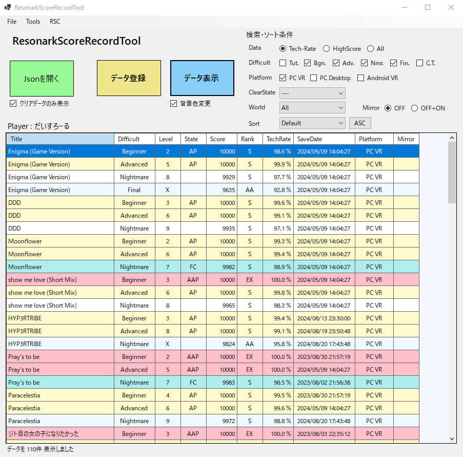

# ResonarkScoreRecordTool
 Author: だいすろーる  
 ver0.9.5 (2024/08/21 update)  

## 画面キャプチャ  

## インストール方法
任意のフォルダに配置して"ResonarkScoreRecordTool.exe"を起動してください。  
Program Filesなど管理者権限が必要な場所には置かないようにしてください。  
  
このプログラムは64bit Windowsで使うことを想定しています。  
初回起動時に.NETのランタイムのインストールが必要な場合があるのでインストールしてください。  

【対応ワールド】  
現在はVRChatの下記ワールドに対応しています（2024/09/10時点）  
- RESONARK 4 ELVES Pt.1 - RhythmGame - v4.1.3a   
(https://vrchat.com/home/world/wrld_236bb7cd-dca2-44a2-9542-3b965e15d37d)
- RESONARK 4 ELVES Pt.2 - RhythmGame - v4.1.2   
(https://vrchat.com/home/world/wrld_27f609ee-beae-40ba-941b-6af6af0efa66)

## 主な機能
- データエクスポートしたJsonファイルの閲覧
- データエクスポートしたJsonファイルよりスコアデータの登録
- 登録したスコアデータの閲覧（フィルタ・ソートなど）
- 収録楽曲一覧の閲覧
- 登録したデータの履歴・削除
- Resonark Championship 4 対象楽曲のスコア閲覧

## 禁止事項 
- ソフトウェアの再配布、販売 
- 自作発言
- プログラムの解析行為 など

## 注意事項など 
本ソフトウェアは非公式のため、公式へのお問い合わせは行わないようお願いします。  
現在はまだ開発中のため予期せぬトラブルなどが発生する可能性があります。その場合の責任は負いかねますのでご了承ください。  
ソフトについてのご意見、ご感想がありましたらDMへご連絡頂けると嬉しいです。  

## 問い合わせ先
だいすろーる (https://twitter.com/comyui_211vt)

## 各種リンク 
- Resonark公式サイト (https://sepnekoya.com/resonark)  
- Resonark公式Twitter (https://twitter.com/resonark_x)  
